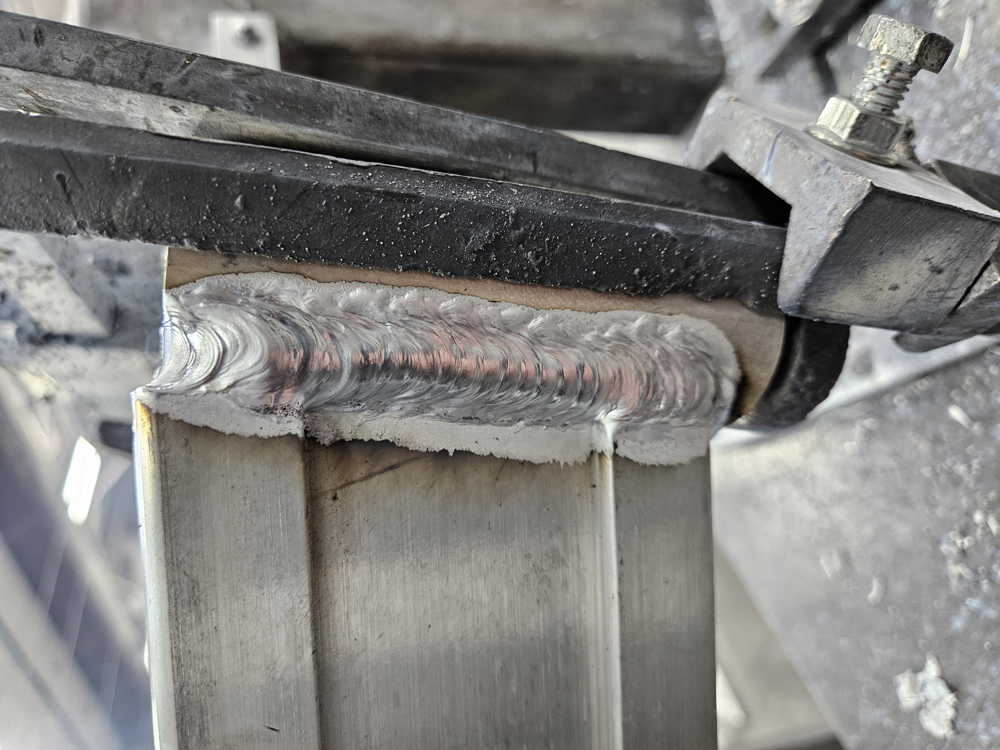

# Jeffery Baker | Robotics & Advanced Manufacturing

### Bridging Precision Fabrication with Automated Systems
I am a Robotics and Automated Manufacturing student at Lone Star College with a background in aerospace-grade welding. My work focuses on the intersection of physical builds and digital logic.

---

## 🛠️ Technical Skillset
* **Manufacturing:** Aerospace Welding, Manual Machining, 3D Printing (Bambu Lab P2S)
* **Electronics:** Raspberry Pi, Ultrasonic Sensors, MOSFET Circuits
* **Robotics:** PLC Programming, Automated Manufacturing Systems
* **Software:** CAD, Git/GitHub, Python

---

## 🚀 Featured Projects

### [Raspberry Pi Ultrasonic Sensor Project]
* **The Goal:** Develop a real-time distance monitoring system using a Raspberry Pi Zero 2 W.
* **The Build:** Integrated HC-SR04 ultrasonic sensors to calculate distance by measuring sound wave travel time, translating physical distance into digital data.
* <table border="0">
  <tr>
    <td>
      
    </td>
    <td>
      
    </td>
    <td>
      <video width="300" controls>
        <source src="UltrasonicSensor.mp4" type="video/mp4">
        Your browser does not support the video tag.
      </video>
    </td>
  </tr>

### [Raspberry Pi Active Buzzer System]
* **The Goal:** Create a programmable audible alert system.
* **The Build:** Utilizing a Raspberry Pi to control an active buzzer via GPIO pins, demonstrating logic-based hardware triggers and circuit management.

---

### [Aerospace Welding Portfolio]
* High-precision fabrication experience within the aerospace industry, focusing on metallurgy and structural integrity.

  
  

---

## 📬 Connect with Me
* **Location:** Spring, Texas
* **LinkedIn:** [www.linkedin.com/in/jeffery-baker-15b767218]
* **Email:** [Jlb107078@gmail.com]
