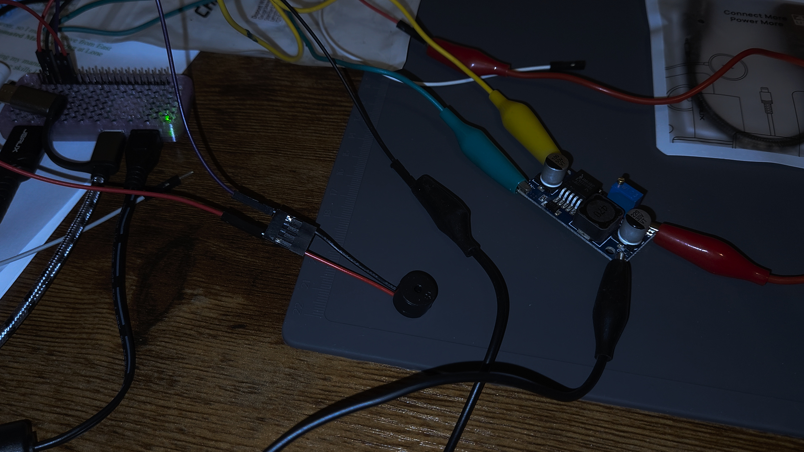
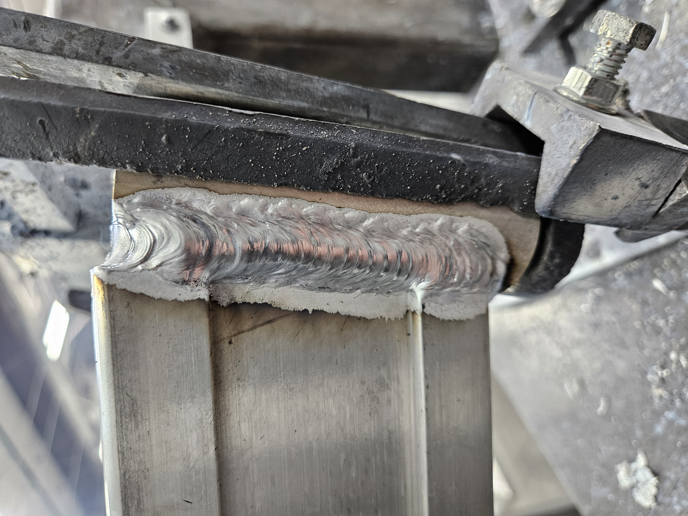

<link rel="icon" type="image/png" href="https://jlb-robotics.me/favicon.png?v=6">

# Jeffery Baker | Robotics & Advanced Manufacturing

### Bridging Precision Fabrication with Automated Systems
I am a Robotics and Automated Manufacturing student at Lone Star College with a background in aerospace-grade welding. My work focuses on the intersection of physical builds and digital logic.
[A.A.S Degree Path](https://www.lonestar.edu/programs-of-study/Engineering-Technician-AAS-Automated-Manufacturing-Technician.htm)
---

## 🛠️ Technical Skillset
* **Manufacturing:** Aluminum Mig Welding, Automated Machining, 3D Printing (Bambu Lab P2S), Industry 4.0
* **Electronics:** Raspberry Pi, Micro Sensors/Actuators, AC/DC Circuits
* **Robotics:** PLC Programming, Automated Manufacturing Systems, Electro-Hydraulics/Pnuematics, Universal Robots
* **Software:** CAD, GitHub, Python3, Bumbu/Creality/Cura Object Slicers, SolidWorks, VSCode/IDE's (Integrated Development Environment)
 

---

## 🚀 Featured Projects

### [Raspberry Pi Ultrasonic Sensor Project]
* **The Goal:** Develop a real-time distance monitoring system using a Raspberry Pi Zero 2 W.
* **Technical Specs:**
    * **Hardware:** HC-SR04 Ultrasonic Sensor, 1kΩ and 2kΩ resistors (Voltage Divider for GPIO safety).
    * **Logic:** Python-based script using the `RPi.GPIO` library to trigger 10µs sonic bursts.
    * **Pins Used:** GPIO 23 (Trigger), GPIO 24 (Echo).

  
  

  <video src="UltrasonicSensor.mp4" width="45%" controls>
    Your browser does not support the video tag.
  </video>

### [Raspberry Pi Active Buzzer System]
* **The Goal:** Create a programmable audible alert system.
* **Technical Specs:**
    * **Hardware:** 5V Active Buzzer, PN2222 Transistor (for current amplification).
    * **Logic:** Pulse Width Modulation (PWM) frequency control to manage alert tones.
    * **Pins Used:** GPIO 18 (PWM Output).

  

  <video src="buzzer_build.mp4" width="45%" controls>
    Your browser does not support the video tag.
  </video>

---

### [Aerospace Welding Portfolio]
* High-precision fabrication experience within the Communications industry, focusing on metallurgy and structural integrity.

  
  

---

## 📬 Connect with Me
* **Location:** Spring, Texas
* **LinkedIn:** [Jeffery L Baker](https://www.linkedin.com/in/jeffery-baker-15b767218/)
* **Email:** [Jlb107078@gmail.com](Jlb107078@gmail.com)
* [📄 View & Download My Full Resume](resume.md)
* ### ✉️ Send Me a Message
<form action="https://formspree.io/f/mpqjeoyw" method="POST" style="max-width: 500px;">
  <label>Your Email:</label> 
  <input type="email" name="email" style="width: 100%; padding: 8px; margin-bottom: 10px;" required> 
  
  <label>Your Message:</label> 
  <textarea name="message" style="width: 100%; height: 100px; padding: 8px;" required></textarea> 
  
  <button type="submit" style="background-color: #333; color: white; padding: 10px 20px; border: none; margin-top: 10px; cursor: pointer;">Send Message</button>
</form>

