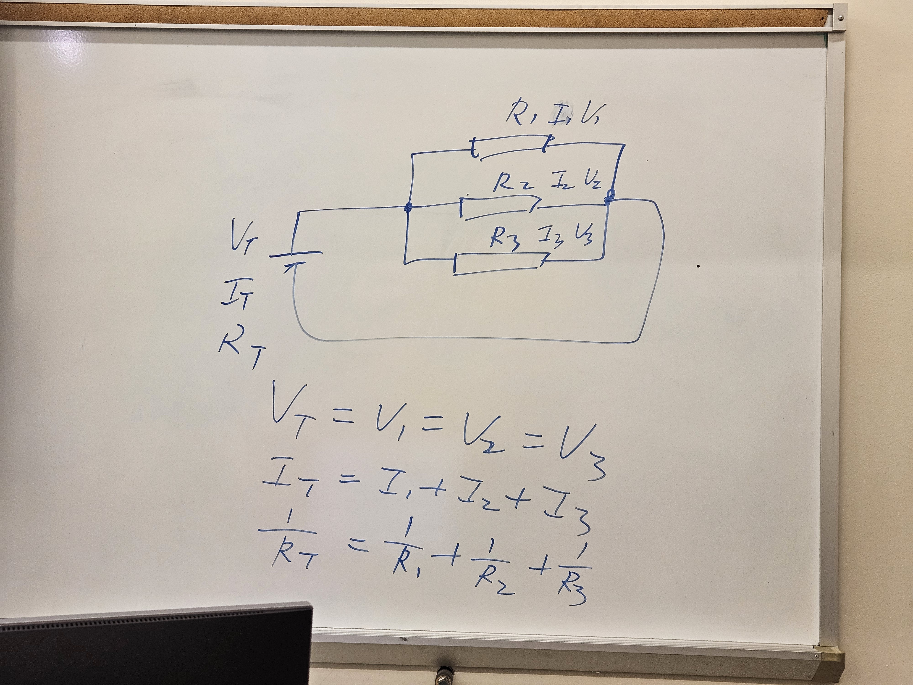
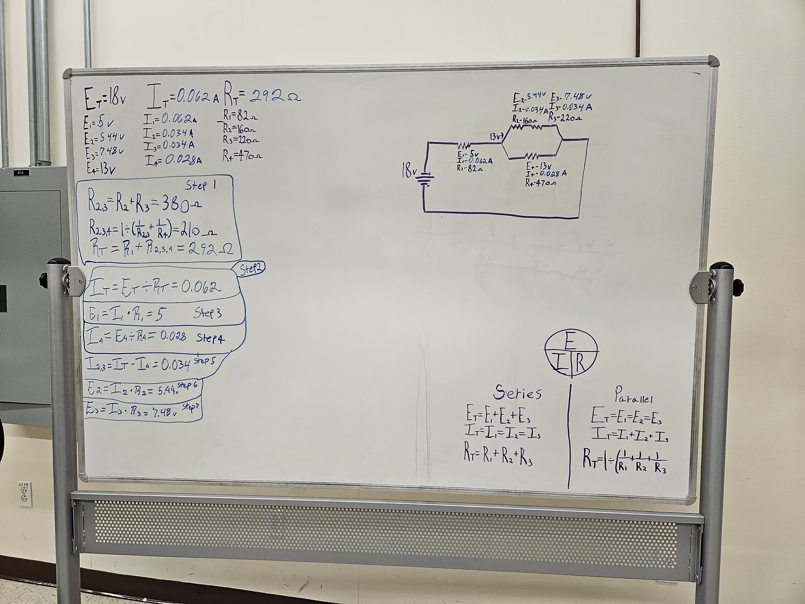

<link rel="icon" type="image/png" href="https://jlb-robotics.me/favicon.png?v=6">

  <a href="./">[ HOME ]</a>
  <a href="projects">[ PROJECTS ]</a>
  <a href="experience">[ EXPERIENCE ]</a>
  <a href="labs">[ COLLEGE LABS ]</a>
  <a href="/JEFFERYBAKER_Resume.pdf" target="_blank" class="nav-link">[ RESUME ]</a>

# Lone Star College | Robotics Lab Media

### Current Coursework: Robotics & Automated Manufacturing
This section contains documented technical results from my circuit analysis and robotics labs at the North Harris campus.

Find more videos on my YouTube channel 
  <a href="https://www.youtube.com/@JlbRobotics" target="_blank">@Jeffery's Knowledge</a>

---

## ⚡ AC/DC Circuits Lab
* **Project:** Combined Series-Parallel Circuits
* **Focus:** Measuring voltage drops and verifying Ohm's Law in complex resistor networks.

  
  

---

## 🤖 PLC & Automation Lab (Coming Soon)
* **Focus:** Programming logic for automated manufacturing systems and Universal Robots (UR) integration.
* **Current Task:** Troubleshooting ladder logic for synchronized industrial arm movements.

  <video src="RoboticsLab.mp4" width="80%" controls>
    Your browser does not support the video tag.
  </video>

---

  <a href="./" style="font-weight:bold;"> << Back to Main Portfolio</a>

>
