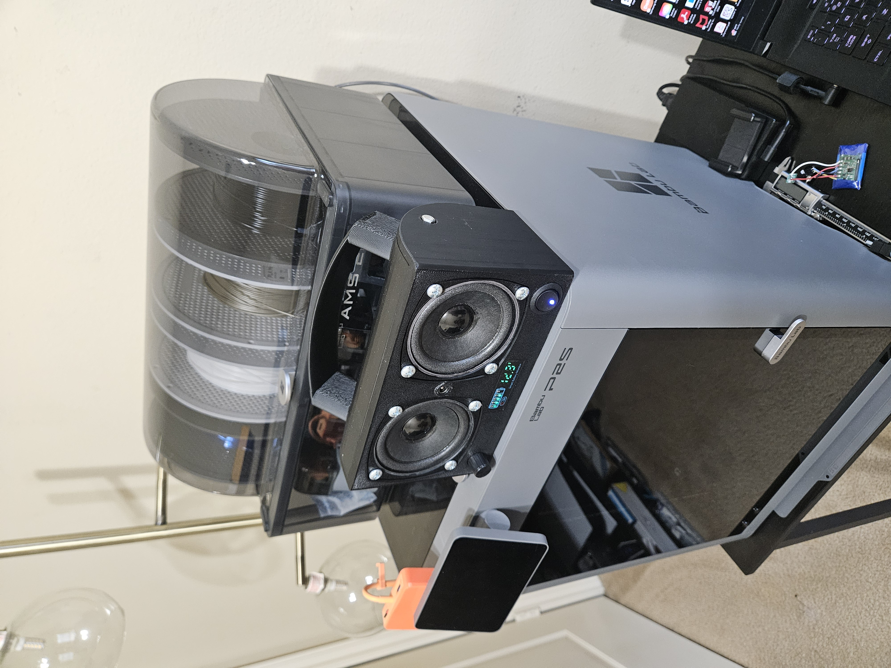
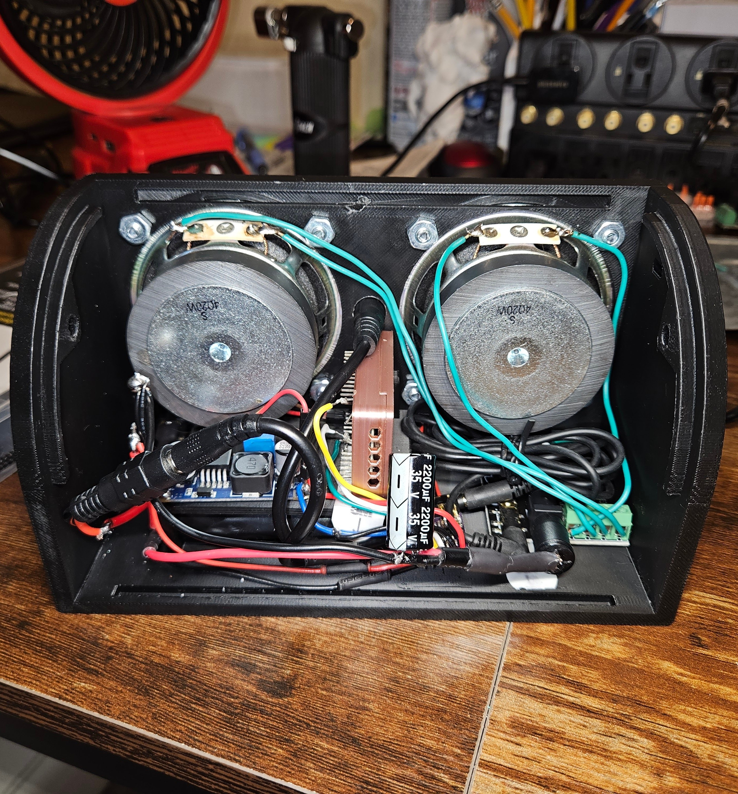

<link rel="icon" type="image/png" href="https://jlb-robotics.me/favicon.png?v=6">

  

    <a href="./" class="nav-link">[ HOME ]</a>
    <a href="projects.md" class="nav-link">[ PROJECTS ]</a>
    <a href="experience.md" class="nav-link">[ EXPERIENCE ]</a>
    <a href="videos.md" class="nav-link">[ VIDEOS ]</a>
    <a href="JEFFERY_BAKER_Resume_Orange.pdf" target="_blank" class="nav-link">[ RESUME ]</a>
  

  <h1>🚀 Engineering & Automation Projects</h1>

  <h2>🛰️ Raspberry Pi Ultrasonic Sensor Project</h2>
  <ul>
    <li><strong>Goal:</strong> Develop a real-time distance monitoring system using a Raspberry Pi Zero 2 W.</li>
    <li><strong>Technical Specs:</strong>
      <ul>
        <li><strong>Hardware:</strong> HC-SR04 Ultrasonic Sensor, 1 kΩ and 2 kΩ resistors (Voltage Divider).</li>
        <li><strong>Logic:</strong> Python-based script using <code>RPi.GPIO</code> library.</li>
      </ul>
    </li>
  </ul>

  

    
    
  

  

  <h2>🔊 Custom ESP32 Bluetooth Speaker</h2>
  <ul>
    <li><strong>Development:</strong> Designed a custom enclosure in SolidWorks and integrated soldered circuitry for high-fidelity audio output.</li>
  </ul>

  

    <h4 style="color: #00d2ff; margin-bottom: 10px;">📋 Bill of Materials & Technical Layout:</h4>
    
    
🔹 Core Electronics & Audio

    <ul>
      <li>Microcontroller: Elegoo ESP32 (CP2102).</li>
      <li>Digital-to-Analog Converter (DAC): PCM5102 I2S IIS DAC.</li>
      <li>Amplifier: PAM8610 2x15W Class D Power Amplifier Board with Control Knob.</li>
      <li>Speakers: Dual 4-Ohm 20W Full-Range Speakers.</li>
    </ul>

    
🔹 Power & Control System

    <ul>
      <li>Main Power Source: 12.6V 3A max 2600mAh Li-ion Battery (Rapthor brand).</li>
      <li>Voltage Step-Down: LM2596 Buck Converter (drops battery voltage to 5V to safely power the ESP32 and DAC).</li>
      <li>Power Switch: 12V 20A Round Blue LED Toggle Switch.</li>
      <li>System Monitor: Battery Monitor / Capacity Indicator.</li>
    </ul>

    
🔹 Wiring, Hardware & Enclosure

    <ul>
      <li>Electrical Wire: 16 Gauge Solid Core Wire.</li>
      <li>Audio Patching: 3.5mm Aux Cable.</li>
      <li>Outer Shell: Custom 3D-Printed Enclosure (designed in SolidWorks over 2 days and printed on my Bambu Lab P1S over 3 days).</li>
    </ul>
  

  

    
    
  

  

  

    <a href="./" style="font-weight:bold; text-decoration: none;">&lt;&lt; Back to Main Portfolio</a>
  

