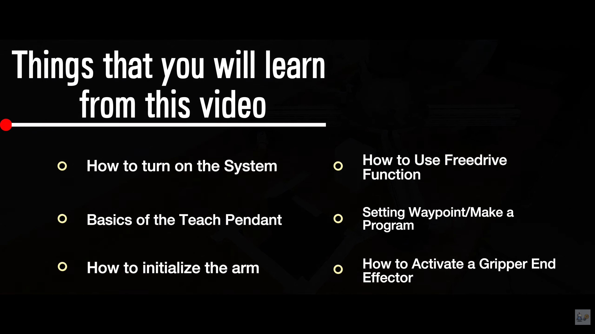

<link rel="icon" type="image/png" href="https://jlb-robotics.me/favicon.png?v=6">

  

    <a href="./" class="nav-link">[ HOME ]</a>
    <a href="projects" class="nav-link">[ PROJECTS ]</a>
    <a href="experience" class="nav-link">[ EXPERIENCE ]</a>
    <a href="videos" class="nav-link active">[ VIDEOS ]</a> 
    <a href="JEFFERY_BAKER_Resume_Orange.pdf" target="_blank" class="nav-link">[ RESUME ]</a>
  

  

    <a href="https://youtube.com/@jlbrobotics?si=rdboNTktWYJEn2gh" target="_blank" class="youtube-link">
      &gt; [ VISIT MY YOUTUBE CHANNEL: Jeffery's Knowledge ] &lt;
    </a>
  

  <h1>Featured Series: Robotic Fundamentals</h1>
  
  <h3>🎬 Episode 1: Introduction to Industrial Robotics & Cobots</h3>
  
Welcome to my technical video series, <strong>Robotic Fundamentals</strong>. This series focuses on deep-dive demonstrations where I explain how to configure, program, and execute operations on collaborative robots (cobots) like the Universal Robots UR3e, alongside heavy-duty industrial platforms like Fanuc systems.

  

  

    
    

      <a href="https://youtu.be/gpvk6R97cx4?si=3UoBg4MYX4fRFkA6" target="_blank" class="animated-video-card">
        CLICK HERE
        
        CLICK HERE
      </a>
    

    

      
    

    

      
    

  

